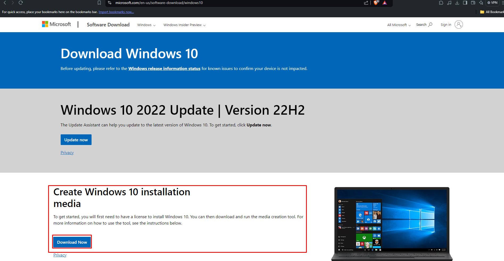

# Malware Analysis Lab

Welcome to the Malware Analysis Lab repository! This guide provides detailed instructions for setting up a secure and effective environment for malware analysis using VirtualBox and FLARE-VM.

## Table of Contents

1. [Introduction](#introduction)
2. [Prerequisites](#prerequisites)
3. [Setup](#setup)
   - [Install VirtualBox](#install-virtualbox)
   - [Download Windows 10 ISO](#download-windows-10-iso)
   - [Create and Configure Virtual Machine](#create-and-configure-virtual-machine)
   - [Install FLARE-VM Inside the Virtual Machine](#install-flare-vm-inside-the-virtual-machine)
4. [Tools and Configuration](#tools-and-configuration)
5. [Network Configuration](#network-configuration)
6. [Analysis Procedures](#analysis-procedures)
7. [Resources](#resources)

## Introduction

This repository provides a comprehensive guide for setting up a malware analysis environment. It is designed to enable both static and dynamic analysis of malware samples without risking contamination of your network.

## Prerequisites

Before you start, ensure you have the following:

- <a href="https://www.virtualbox.org/" target="_blank">VirtualBox</a> installed
- Windows 10 ISO file
- Basic understanding of malware analysis and cybersecurity

## Setup

### Install VirtualBox

1. Download and install <a href="https://www.virtualbox.org/" target="_blank">VirtualBox</a>.

### Download Windows 10 ISO

1. Obtain a Windows 10 ISO file for installation.

2. **Download Button Location:**
   - Visit the [Windows 10 download page](https://www.microsoft.com/en-us/software-download/windows10ISO).
   - Look for the download button. See the image below for guidance:

   

### Create and Configure Virtual Machine

1. **Create a New VM:**
   - Open VirtualBox and create a new virtual machine.
   - Attach the Windows 10 ISO file to the VM.

2. **Configure Windows Settings:**
   - Install Windows 10 on the VM.
   - **Disable Windows Updates:**
     - Go to `Settings` > `Update & Security` > `Windows Update` and turn off updates.
   - **Disable Windows Defender:**
     - Open Group Policy Editor (`gpedit.msc`).
     - Navigate to `Computer Configuration` > `Administrative Templates` > `Windows Components` > `Microsoft Defender Antivirus`.
     - Set `Turn off Microsoft Defender Antivirus` to `Enabled`.
   - **Disable Tamper Protection:**
     - Open Windows Security settings.
     - Go to `Virus & threat protection`.
     - Click on `Manage settings` under Virus & threat protection settings.
     - Toggle off `Tamper Protection`.

### Install FLARE-VM Inside the Virtual Machine

1. **Download FLARE-VM:**
   - Inside the Windows 10 VM, visit the <a href="https://github.com/mandiant/flare-vm" target="_blank">FLARE-VM GitHub page</a>.

2. **Run the FLARE-VM Installation:**
   - Follow the instructions on the FLARE-VM GitHub page to install FLARE-VM inside the VM.
   - FLARE-VM uses Chocolatey and Boxstarter for managing and automating software installations.
   - Ensure tools such as FakeNet, HashMyFiles, Regshot, and Ghidra are installed.

3. **System Requirements for FLARE-VM:**
   - **Disk Capacity:** At least 60 GB
   - **Memory:** At least 2 GB

## Tools and Configuration

- **FakeNet:** Simulates network services.
- **HashMyFiles:** Calculates hash values of files.
- **Regshot:** Takes snapshots of the registry before and after modifications.
- **Ghidra:** Reverse engineering tool for analyzing binaries.

Ensure these tools are correctly installed and configured as part of the FLARE-VM setup.

## Network Configuration

- **During Malware Analysis:**
  - Set the VM network type to "Host-only" to isolate the VM from the external network and prevent any potential malware from affecting your network.
  
- **For Other Activities:**
  - You may switch the network type to other configurations as needed, but ensure to revert to "Host-only" before performing malware analysis.

## Analysis Procedures

Both static and dynamic malware analysis can be conducted within this controlled environment. Follow best practices for malware analysis to avoid unintended consequences.

## Resources

- <a href="https://github.com/mandiant/flare-vm" target="_blank">FLARE-VM GitHub Repository</a>
- <a href="https://www.virtualbox.org/" target="_blank">VirtualBox</a>
- <a href="https://www.microsoft.com/en-us/software-download/windows10ISO" target="_blank">Windows 10 ISO</a>
